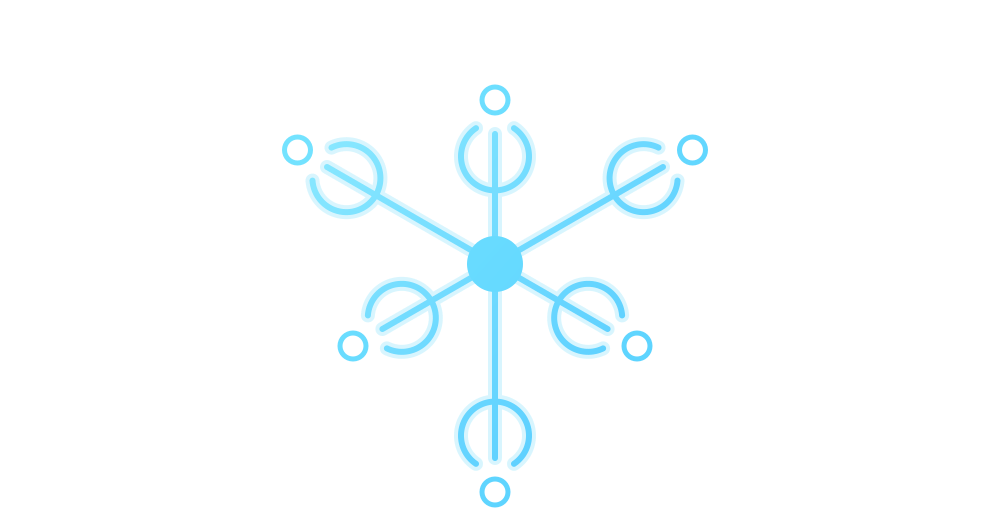

# react-api-bridge

> **语言版本**: [English](./README.md) | [简体中文](#)

React 的作用域命令式 API 桥。

无需 prop drilling，就能在组件树中暴露和调用组件方法。和事件总线不同，`react-api-bridge` 提供的是可直接调用的强类型 API，并且支持作用域隔离、父级查找、异步等待注册和多实例。



## 这个库解决什么问题

React 很擅长状态流转，但当你想做“命令式组件协作”时，经常会遇到这些问题：

- 你想在很远的组件里调用某个组件的方法
- `forwardRef` 只适合直接父子关系
- Context 里开始塞越来越多的回调函数
- 事件总线太全局，语义也太松散

`react-api-bridge` 的思路是：把组件能力注册成一个按 React 子树作用域解析的命令式 API。

## 它是什么

- 一个组件命令式 API 注册表
- 一个带作用域的跨组件方法访问机制
- 一个支持 TypeScript 的直接调用模型
- 一个支持异步等待目标组件挂载的 API 桥

## 它不是什么

- 不是状态管理库
- 不是 Context 的替代品
- 不是 EventEmitter 的换皮实现
- 不是只能处理父子 `ref` 的工具

## 它和 EventEmitter 的区别

| EventEmitter | react-api-bridge |
| --- | --- |
| 广播事件 | 暴露组件 API |
| 消费者监听 payload | 消费者直接调用方法 |
| 通常是全局或单实例级别 | 按 Boundary 作用域解析 |
| 适合通知和广播 | 适合命令式组件协作 |
| `emit('open')` | `modalAPI.current?.open()` |

如果你的真实需求是“我要调用某个组件能力”，而不是“我要广播一个事件”，那这个库通常比事件总线更合适。

## 安装

```bash
npm install @ryo-98/react-api-bridge
```

## 快速示例

下面这个例子演示：在同一子树里的任意位置打开一个 Modal，而不用层层传 props 或 refs。

```tsx
import { useState } from 'react';
import {
    createBridge,
    createBoundary,
    useAPI,
    useRegister
} from '@ryo-98/react-api-bridge';

interface AppAPIs {
    modal: {
        open: (content: string) => void;
        close: () => void;
    };
}

const bridge = createBridge<AppAPIs>();
const Boundary = createBoundary(bridge);

function ModalHost() {
    const [content, setContent] = useState<string | null>(null);

    useRegister(bridge, 'modal', () => ({
        open: (nextContent) => setContent(nextContent),
        close: () => setContent(null)
    }), []);

    if (!content) return null;
    return <dialog open>{content}</dialog>;
}

function OpenButton() {
    const modalAPI = useAPI(bridge, 'modal');

    return (
        <button onClick={() => modalAPI.current?.open('Hello from anywhere')}>
            打开弹窗
        </button>
    );
}

export default function App() {
    return (
        <Boundary>
            <ModalHost />
            <section>
                <OpenButton />
            </section>
        </Boundary>
    );
}
```

## 什么时候适合用它

当你有下面这些需求时，这个库会很顺手：

- Modal、Drawer、Toast、命令面板需要被很多位置触发
- Tree、Form Wizard、复杂嵌套组件之间需要互相调用方法
- 插件系统、Slot 系统需要局部可见的 API
- 你要共享的是“动作能力”而不是“状态”
- 目标组件可能稍后才挂载，需要先等待 API 就绪

## 核心优势

### 1. Boundary 作用域隔离

Boundary 可以理解为作用域。相同 API 名可以在不同子树里共存，而不会互相污染。

```tsx
import { createBoundary } from '@ryo-98/react-api-bridge';

const Boundary = createBoundary(bridge);

function App() {
    return (
        <>
            <WidgetProvider name="global" />

            <Boundary>
                <WidgetProvider name="local" />
                <WidgetConsumer /> {/* 这里只能看到 "local" */}
            </Boundary>

            <WidgetConsumer /> {/* 这里只能看到 "global" */}
        </>
    );
}
```

### 2. 支持访问父级作用域 API

有时候你要拿当前 Boundary 的 API，有时候你要显式拿父级的。

```tsx
import { useAPI, useUpperAPI } from '@ryo-98/react-api-bridge';

function NestedConsumer() {
    const currentAPI = useAPI(bridge, 'widget');
    const parentAPI = useUpperAPI(bridge, 'widget');

    return (
        <button onClick={() => parentAPI?.current?.refresh()}>
            刷新父级 widget
        </button>
    );
}
```

### 3. 支持异步等待 API 注册

如果目标组件还没挂载，不需要自己写轮询、延迟事件或复杂的 deferred 逻辑。

```tsx
import { getBridgeAPIAsync } from '@ryo-98/react-api-bridge';

async function openWhenReady() {
    const modalAPI = await getBridgeAPIAsync(bridge, 'modal');
    modalAPI.current?.open('Loaded later');
}
```

### 4. 支持多实例 API

多个组件可以注册同一个 API 名称。

```tsx
const bridge = createBridge<{
    notification: {
        id: string;
        show: (message: string) => void;
    };
}>()({
    notification: { isMulti: true }
});

function NotificationPanel({ id }: { id: string }) {
    useRegister(bridge, 'notification', () => ({
        id,
        show: (message) => console.log(id, message)
    }), [id]);
}

function ShowAll() {
    const notifications = useAPI(bridge, 'notification');

    return (
        <button onClick={() => {
            notifications.forEach(api => api.current?.show('hello'));
        }}>
            全部触发
        </button>
    );
}
```

### 5. Boundary Payload

你可以给 Boundary 挂一份 payload，并在该作用域内任何地方读取。

```tsx
import {
    createBridge,
    createBoundary,
    useBoundaryPayload
} from '@ryo-98/react-api-bridge';

const bridge = createBridge<{
    panel: { refresh: () => void };
}, { theme: string }>({
    theme: 'light'
});

const Boundary = createBoundary(bridge);

function Screen() {
    return (
        <Boundary payload={{ theme: 'dark' }}>
            <Panel />
        </Boundary>
    );
}

function Panel() {
    const payload = useBoundaryPayload(bridge);
    return <div>{payload.theme}</div>;
}
```

## 理解方式

你可以把它理解成：

- 可以跨组件树使用的 `ref`
- 面向“命令式能力”而不是普通值的 Context
- 按 React 子树作用域解析的命令注册表

## 典型场景

- Modal / Drawer 管理器
- 树节点联动
- 多步骤表单或 Wizard
- 局部插件系统
- 不适合做成全局状态、但又需要跨组件调用的方法

## 最佳实践

- 在模块顶层创建 bridge，不要在组件内重复创建
- 每个 API 保持单一职责
- 调用前检查 `apiRef.current`
- 需要局部隔离时优先使用 `Boundary`
- 只有确实存在多个活跃提供者时才开启 `isMulti: true`
- API 名尽量语义化，比如 `modal`、`treeNode`、`wizard`

## 什么时候不适合用

下面这些情况不建议优先使用它：

- 只是简单的父子 `ref`
- 真正的问题其实是状态共享
- 一个普通 callback prop 就够了
- 用常规 Context 已经可以很好表达问题

## API 参考

### Bridge 创建

- `createBridge<APIs, PayloadType>(globalPayload?, options?)`

### Hooks

- `useRegister(bridge, name, factory, deps, options?)`
- `useAPI(bridge, name, options?)`
- `useUpperAPI(bridge, name, options?)`
- `useBoundaryPayload(bridge, options?)`
- `useUpperBoundaryPayload(bridge, options?)`
- `useBoundaryContext(bridge, payload?)`
- `useTools(bridge, options?)`

### 方法

- `getBridgeAPI(bridge, name, options?)`
- `getBridgeAPIAsync(bridge, name, options?)`

### 组件

- `createBoundary(bridge)`

## FAQ

**为什么不直接用 EventEmitter？**

因为这个库建模的是 API，不是事件。你拿到的是组件能力本身，并且它受 React Boundary 作用域控制。

**为什么不直接用 Context？**

Context 更适合分发值。这个库更适合共享 `open`、`focus`、`refresh`、`expand`、`submit` 这类命令式能力。

**为什么不直接用 `forwardRef`？**

`forwardRef` 非常适合直接父子访问；这个库解决的是调用方和提供方距离很远，或者它们处于不同局部作用域的问题。

## 许可证

MIT
